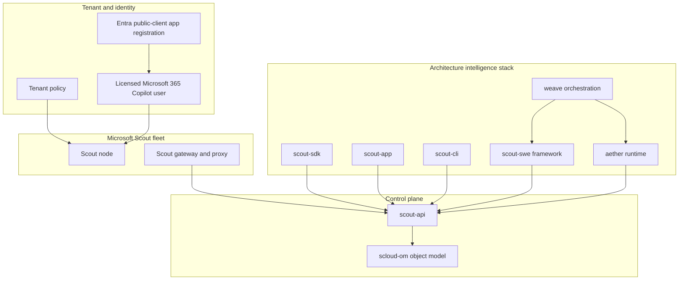

# Architecture overview

Scout Deployer is the node bootstrap and provisioning layer in a larger Scout architecture.
The complete system exposes a Microsoft Scout fleet as typed, programmable, composable,
and observable infrastructure.

## Architecture intelligence

| Question | Surface | Mechanism |
|---|---|---|
| What exists in the fleet? | `scout-sdk` and `scloud-om` | Typed catalog, nodes, agents, resources, and fleet summary |
| How should it behave? | Managed policy model | Parse, render, and diff policy for Windows, macOS, and Linux |
| How do agents communicate? | A2A packages | Agent2Agent protocol types and JSON Schemas |
| Where does work run? | `aether` | `ScoutRuntime`, sandbox execution, scheduling, and A2A transport |
| How is work composed? | `weave` | `SwarmGraph` DAG and A2A/MCP/Scout router |
| How do tools reach the fleet? | `scout-app` and `scout-cli` | MCP tools/resources/prompts and terminal commands |
| How is traffic routed? | APIM policies | Control-plane, A2A, and MCP routing |

## Interconnection map

## Data and control flow

| Layer | Repository | Depends on | Exposes |
|---|---|---|---|
| Contract | `scout-sdk` | Scout API/OpenAPI | TypeScript and Python clients, policy helpers, mock transport |
| Framework | `scout-swe` | Scout API and runtime | SDK, A2A, runtime, CLI, APIM, automations |
| Runtime | `aether` | Scout API | Runtime, sandbox executor, scheduler, transport |
| Orchestration | `weave` | Framework and runtime | Agent/tool DAG and routing |
| Integration | `scout-app` | Scout API | MCP server and MCP host |
| Operator | `scout-cli` | Scout API | Fleet, policy, task, and catalog commands |

Each layer carries the types it needs to run independently, but every layer converges on
the same control-plane contract and managed-policy model.

## Control-plane object model

The source architecture identifies the following canonical entities:

- `Node`
- `Agent`
- `Policy`
- `Session`
- `Task`
- `Fleet`
- `Resource`
- `Catalog`

The control plane provides route families for health, service information, catalog,
fleet and node inventory, policy rendering, sessions, tasks, manifests, and schemas.
SDKs should generate or validate their models against the same OpenAPI and schema sources.

## Identity layer

Scout sign-in depends on a single-tenant Entra public-client registration:

- No client secret
- Native custom-protocol and broker redirect URIs
- Delegated Microsoft Graph permissions only
- Interactive, device-code, and silent-refresh flows

The identity registration is the front door to Work IQ data. The managed-policy setting
and the licensed account are separate requirements: policy clears the organization gate,
while sign-in establishes the licensed user context.

## Security boundaries

- **Sandbox boundary:** shell, writes, permissions, providers, models, and browser egress can be constrained by managed policy.
- **Identity boundary:** delegated Graph permissions act as the signed-in user, never as an application identity.
- **Configuration boundary:** tenant identifiers and hosts remain outside source control.
- **Routing boundary:** APIM and MCP routing expose only documented contracts.
- **Operational boundary:** logs must not print passwords, tokens, or private configuration.
